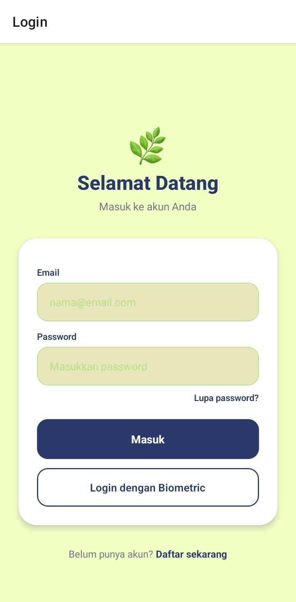
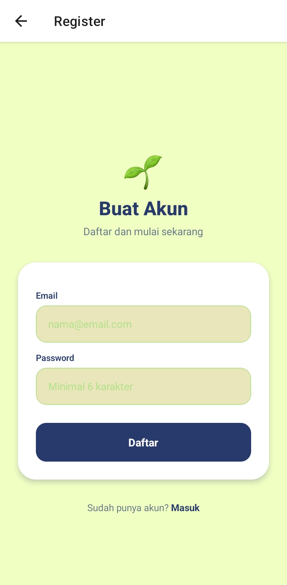
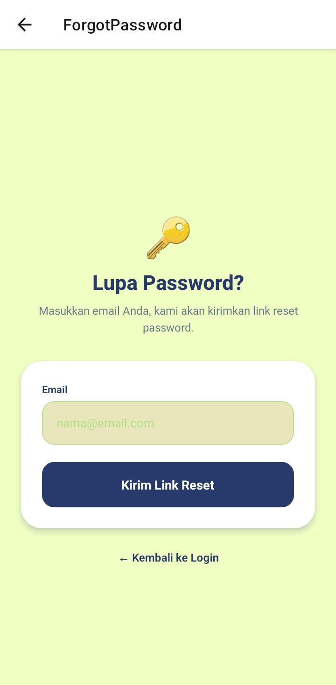
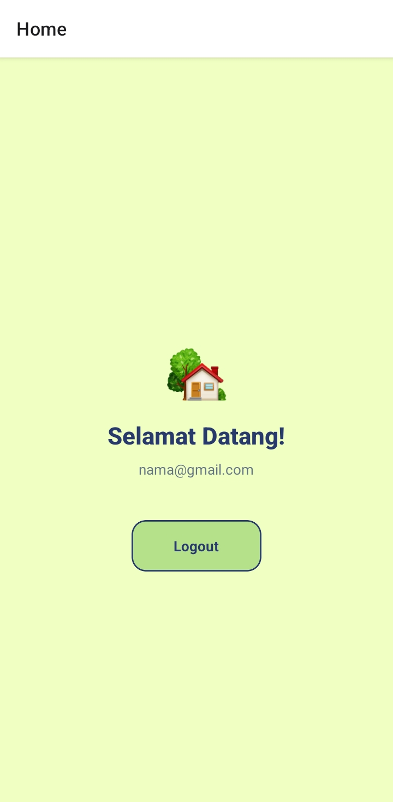

# Auth-Praktikum-P9

## Informasi Mahasiswa

- **Nama**  : Naomi Sabila Imani
- **NIM**   : 2410501061
- **Kelas** : A

## Deskripsi

Aplikasi auth sederhana yang mengimplementasikan sistem autentikasi dan otorisasi lengkap. Aplikasi ini mencakup login email/password, biometric authentication, protected routes, password reset, email verification, dan auto-logout setelah idle.

## Dependencies Utama

- firebase
- @react-native-async-storage/async-storage
- expo-secure-store
- expo-local-authentication
- react-native-safe-area-context

## Fitur yang Dikembangkan

- Login & Register dengan Email/Password (Firebase Authentication)
- Email Verification setelah Register
- Password Reset via Email
- Biometric Authentication sebagai pengganti password pada login berikutnya
- JWT Token disimpan aman menggunakan expo-secure-store
- Auto-logout setelah 5 menit idle (menggunakan AppState + setTimeout)

## Screenshot Preview

<p>
  
  
  
  
</p>

## Video Demo

Link demo aplikasi: https://drive.google.com/file/d/1Q8BVPTubDLc0ZhdnPWFUff3ayvIXWcKI/view?usp=drivesdk

## Cara Menjalankan

Aplikasi ini menggunakan Expo.

### 1. Clone Repository

```bash
git clone https://github.com/naomisabila/expo-firebase-auth-naomi.git
```

### 2. Masuk Ke Folder Project

```bash
cd auth-praktikum
```

### 3. Install Dependencies

```bash
npm install
```

### 4. Jalankan Aplikasi

```bash
npx expo start
```
